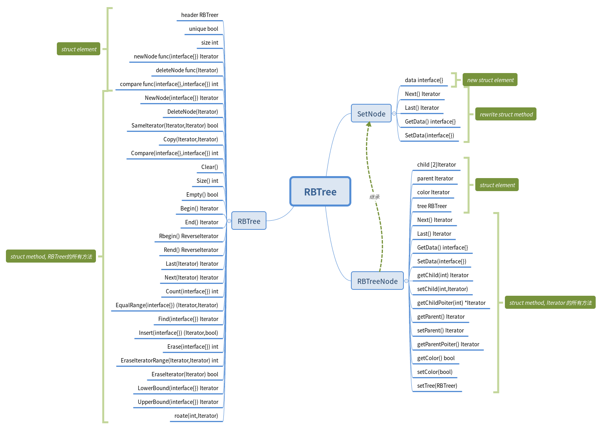

###结构图

###学习资料:
- [wiki红黑树讲解]( https://zh.wikipedia.org/wiki/%E7%BA%A2%E9%BB%91%E6%A0%91)
- 侯捷 STL源码剖析
- [qyuhen性能优化技巧](https://www.jianshu.com/u/44d32fdece77)
- [qyuhen 学习笔记](https://github.com/qyuhen/book)
- [深入理解 Go Interface](http://legendtkl.com/2017/06/12/understanding-golang-interface/)
- [Go Interface 源码剖析](http://legendtkl.com/2017/07/01/golang-interface-implement/)
- [Golang逃逸分析](https://gocn.io/article/355)
- sort,runtime,reflect包源码
- [golang 垃圾回收机制（算法）](https://lengzzz.com/note/gc-in-golang)
- [ golang的垃圾回收（GC）机制]( http://blog.csdn.net/liangzhiyang/article/details/52670021
)