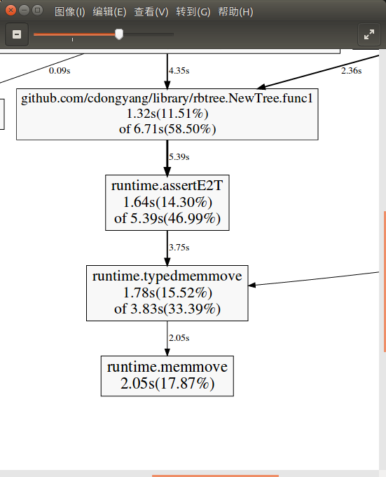
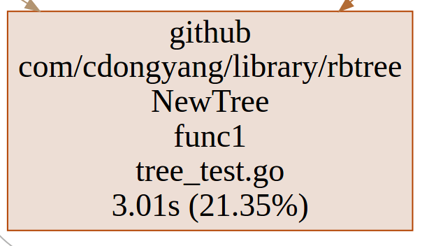

```
ubuntu@dongyang-K46CB:~/go/src/github.com/cdongyang/library/rbtree$ go tool pprof cpu.out
File: rbtree.test
Type: cpu
Time: Dec 23, 2017 at 9:12am (CST)
Duration: 39.01s, Total samples = 41.70s (106.88%)
Entering interactive mode (type "help" for commands, "o" for options)
(pprof) top
Showing nodes accounting for 23270ms, 55.80% of 41700ms total
Dropped 158 nodes (cum <= 208.50ms)
Showing top 10 nodes out of 81
      flat  flat%   sum%        cum   cum%
    8570ms 20.55% 20.55%     9970ms 23.91%  runtime.ifaceeq /usr/local/go/src/runtime/alg.go
    5210ms 12.49% 33.05%    24930ms 59.78%  github.com/cdongyang/library/rbtree.(*RBTree).insert /home/ubuntu/go/src/github.com/cdongyang/library/rbtree/RBTree.go
    1450ms  3.48% 36.52%     6710ms 16.09%  github.com/cdongyang/library/rbtree.(*RBTree).insertAdjust /home/ubuntu/go/src/github.com/cdongyang/library/rbtree/RBTree.go
    1450ms  3.48% 40.00%     1780ms  4.27%  github.com/cdongyang/library/rbtree_test.BenchmarkSetInsert1E5.func1 /home/ubuntu/go/src/github.com/cdongyang/library/rbtree/bench1e5_test.go
    1400ms  3.36% 43.36%     1400ms  3.36%  runtime.memequal64 /usr/local/go/src/runtime/alg.go
    1150ms  2.76% 46.12%     2650ms  6.35%  runtime.scanobject /usr/local/go/src/runtime/mgcmark.go
    1090ms  2.61% 48.73%     2540ms  6.09%  runtime.mallocgc /usr/local/go/src/runtime/malloc.go
    1060ms  2.54% 51.27%     1060ms  2.54%  runtime.heapBitsForObject /usr/local/go/src/runtime/mbitmap.go
     970ms  2.33% 53.60%     3090ms  7.41%  github.com/cdongyang/library/rbtree.NewCustomSet.func1 /home/ubuntu/go/src/github.com/cdongyang/library/rbtree/set.go
		 920ms  2.21% 55.80%      920ms  2.21%  github.com/cdongyang/library/rbtree.(*SetNode).GetKey /home/ubuntu/go/src/github.com/cdongyang/library/rbtree/set.go
```
#优化一
runtime.ifaceeq为interface的相等比较
将 Iterator == Iterator 这类interface的比较用same函数进行比较,same函数里通过断言为原类型进行比较来加快速度
得到下面的cpu profile

```
File: rbtree.test
Type: cpu
Time: Dec 23, 2017 at 5:43pm (CST)
Duration: 4.61s, Total samples = 4.83s (104.75%)
Entering interactive mode (type "help" for commands, "o" for options)
(pprof) top
Showing nodes accounting for 2910ms, 60.25% of 4830ms total
Dropped 70 nodes (cum <= 24.15ms)
Showing top 10 nodes out of 66
      flat  flat%   sum%        cum   cum%
     800ms 16.56% 16.56%     3320ms 68.74%  github.com/cdongyang/library/rbtree.(*RBTree).insert /home/ubuntu/go/src/github.com/cdongyang/library/rbtree/RBTree.go
     500ms 10.35% 26.92%      910ms 18.84%  github.com/cdongyang/library/rbtree.(*SetNode).Compare <autogenerated>
     360ms  7.45% 34.37%      360ms  7.45%  github.com/cdongyang/library/rbtree.(*IntKey).Compare <autogenerated>
     260ms  5.38% 39.75%      260ms  5.38%  github.com/cdongyang/library/rbtree.NewSet.func3 /home/ubuntu/go/src/github.com/cdongyang/library/rbtree/set.go
     200ms  4.14% 43.89%      930ms 19.25%  github.com/cdongyang/library/rbtree.(*RBTree).insertAdjust /home/ubuntu/go/src/github.com/cdongyang/library/rbtree/RBTree.go
     180ms  3.73% 47.62%      180ms  3.73%  github.com/cdongyang/library/rbtree.(*SetNode).getColor <autogenerated>
     170ms  3.52% 51.14%      350ms  7.25%  github.com/cdongyang/library/rbtree.(*RBTree).Find /home/ubuntu/go/src/github.com/cdongyang/library/rbtree/RBTree.go
     160ms  3.31% 54.45%      370ms  7.66%  github.com/cdongyang/library/rbtree.(*RBTree).eraseAdjust /home/ubuntu/go/src/github.com/cdongyang/library/rbtree/RBTree.go
     160ms  3.31% 57.76%      420ms  8.70%  github.com/cdongyang/library/rbtree.(*RBTree).leftRoate /home/ubuntu/go/src/github.com/cdongyang/library/rbtree/RBTree.go
     120ms  2.48% 60.25%      120ms  2.48%  runtime.heapBitsForObject /usr/local/go/src/runtime/mbitmap.go
```

#优化二:
第二行github.com/cdongyang/library/rbtree.(*SetNode).Compare 
将Iterator.Compare 改为 Iterator.GetKey().Compare
得到下面的cpuprofile

```
File: rbtree.test
Type: cpu
Time: Dec 23, 2017 at 6:01pm (CST)
Duration: 4.61s, Total samples = 4.87s (105.73%)
Entering interactive mode (type "help" for commands, "o" for options)
(pprof) top10
Showing nodes accounting for 2890ms, 59.34% of 4870ms total
Dropped 59 nodes (cum <= 24.35ms)
Showing top 10 nodes out of 71
      flat  flat%   sum%        cum   cum%
     980ms 20.12% 20.12%     3320ms 68.17%  github.com/cdongyang/library/rbtree.(*RBTree).insert /home/ubuntu/go/src/github.com/cdongyang/library/rbtree/RBTree.go
     340ms  6.98% 27.10%     1080ms 22.18%  github.com/cdongyang/library/rbtree.(*RBTree).insertAdjust /home/ubuntu/go/src/github.com/cdongyang/library/rbtree/RBTree.go
     330ms  6.78% 33.88%      330ms  6.78%  github.com/cdongyang/library/rbtree.(*IntKey).Compare <autogenerated>
     260ms  5.34% 39.22%      260ms  5.34%  github.com/cdongyang/library/rbtree.NewSet.func3 /home/ubuntu/go/src/github.com/cdongyang/library/rbtree/set.go
     250ms  5.13% 44.35%      250ms  5.13%  github.com/cdongyang/library/rbtree.(*SetNode).GetKey /home/ubuntu/go/src/github.com/cdongyang/library/rbtree/set.go
     220ms  4.52% 48.87%      380ms  7.80%  runtime.scanobject /usr/local/go/src/runtime/mgcmark.go
     130ms  2.67% 51.54%      360ms  7.39%  github.com/cdongyang/library/rbtree.(*RBTree).Find /home/ubuntu/go/src/github.com/cdongyang/library/rbtree/RBTree.go
     130ms  2.67% 54.21%      350ms  7.19%  github.com/cdongyang/library/rbtree.(*RBTree).leftRoate /home/ubuntu/go/src/github.com/cdongyang/library/rbtree/RBTree.go
     130ms  2.67% 56.88%      130ms  2.67%  github.com/cdongyang/library/rbtree.(*SetNode).rightChild <autogenerated>
     120ms  2.46% 59.34%      300ms  6.16%  runtime.mallocgc /usr/local/go/src/runtime/malloc.go
```

```
fatal error: bulkBarrierPreWrite: unaligned arguments

goroutine 5 [running]:
runtime.throw(0x547b95, 0x28)
        /usr/local/go/src/runtime/panic.go:605 +0x95 fp=0xc42006cca8 sp=0xc42006cc88 pc=0x42a0b5
runtime.bulkBarrierPreWrite(0xc4200ee000, 0xc42044c9f2, 0x28)
        /usr/local/go/src/runtime/mbitmap.go:557 +0x328 fp=0xc42006cd00 sp=0xc42006cca8 pc=0x411b28
runtime.typedmemmove(0x52b820, 0xc4200ee000, 0xc42044c9f2)
        /usr/local/go/src/runtime/mbarrier.go:243 +0xac fp=0xc42006cd38 sp=0xc42006cd00 pc=0x4109bc
reflect.typedmemmove(0x52b820, 0xc4200ee000, 0xc42044c9f2)
        /usr/local/go/src/runtime/mbarrier.go:268 +0x3f fp=0xc42006cd60 sp=0xc42006cd38 pc=0x410a0f
reflect.packEface(0x52b820, 0xc42044c9f2, 0x199, 0xc4200765a0, 0x0)
        /usr/local/go/src/reflect/value.go:112 +0xa9 fp=0xc42006cda0 sp=0xc42006cd60 pc=0x48ccb9
reflect.valueInterface(0x52b820, 0xc42044c9f2, 0x199, 0xc42006ce01, 0x4f325a, 0xc42033a5b0)
        /usr/local/go/src/reflect/value.go:961 +0xe9 fp=0xc42006cdf8 sp=0xc42006cda0 pc=0x48e679
reflect.Value.Interface(0x52b820, 0xc42044c9f2, 0x199, 0x1, 0x0)
        /usr/local/go/src/reflect/value.go:931 +0x44 fp=0xc42006ce38 sp=0xc42006cdf8 pc=0x48e564
fmt.(*pp).printValue(0xc420046000, 0x52b820, 0xc42044c9f2, 0x199, 0x76, 0x1)
        /usr/local/go/src/fmt/print.go:692 +0x2d69 fp=0xc42006d078 sp=0xc42006ce38 pc=0x4a10d9
fmt.(*pp).printValue(0xc420046000, 0x526b00, 0xc42044c9f2, 0x16, 0x76, 0x0)
        /usr/local/go/src/fmt/print.go:846 +0x1dce fp=0xc42006d2b8 sp=0xc42006d078 pc=0x4a013e
fmt.(*pp).printArg(0xc420046000, 0x526b00, 0xc42044c9f2, 0x76)
        /usr/local/go/src/fmt/print.go:682 +0x1e5 fp=0xc42006d338 sp=0xc42006d2b8 pc=0x49db65
fmt.(*pp).doPrint(0xc420046000, 0xc42006d488, 0x1, 0x1)
        /usr/local/go/src/fmt/print.go:1124 +0x72 fp=0xc42006d3d0 sp=0xc42006d338 pc=0x4a2ed2
fmt.Sprint(0xc42006d488, 0x1, 0x1, 0x0, 0xc4203c77e0)
        /usr/local/go/src/fmt/print.go:232 +0x52 fp=0xc42006d428 sp=0xc42006d3d0 pc=0x49a322
log.Fatal(0xc42006d488, 0x1, 0x1)
        /usr/local/go/src/log/log.go:306 +0x3f fp=0xc42006d468 sp=0xc42006d428 pc=0x4efe4f
github.com/cdongyang/library/rbtree.(*tree).getmost(0xc4200ec620, 0x0, 0xc4203c7701)
        /home/ubuntu/go/src/github.com/cdongyang/library/rbtree/tree_test.go:52 +0xae fp=0xc42006d4b8 sp=0xc42006d468 pc=0x4f2f5e
github.com/cdongyang/library/rbtree.(*tree).Leftmost(0xc4200ec620, 0x510400)
        /home/ubuntu/go/src/github.com/cdongyang/library/rbtree/tree_test.go:37 +0x34 fp=0xc42006d4e0 sp=0xc42006d4b8 pc=0x4f2e44
github.com/cdongyang/library/rbtree.testTree(0xc4200940f0, 0x3b4, 0x0)
        /home/ubuntu/go/src/github.com/cdongyang/library/rbtree/tree_test.go:148 +0xaea fp=0xc42006df40 sp=0xc42006d4e0 pc=0x4f3e9a
github.com/cdongyang/library/rbtree.TestTree(0xc4200940f0)
        /home/ubuntu/go/src/github.com/cdongyang/library/rbtree/tree_test.go:335 +0xd9 fp=0xc42006dfa8 sp=0xc42006df40 pc=0x4f6ce9
testing.tRunner(0xc4200940f0, 0x5498a0)
        /usr/local/go/src/testing/testing.go:746 +0xd0 fp=0xc42006dfd0 sp=0xc42006dfa8 pc=0x4b3c40
runtime.goexit()
        /usr/local/go/src/runtime/asm_amd64.s:2337 +0x1 fp=0xc42006dfd8 sp=0xc42006dfd0 pc=0x457721
created by testing.(*T).Run
        /usr/local/go/src/testing/testing.go:789 +0x2de

goroutine 1 [chan receive]:
testing.(*T).Run(0xc420094000, 0x54138f, 0x8, 0x5498a0, 0x4694b6)
        /usr/local/go/src/testing/testing.go:790 +0x2fc
testing.runTests.func1(0xc420094000)
        /usr/local/go/src/testing/testing.go:1004 +0x64
testing.tRunner(0xc420094000, 0xc420041de0)
        /usr/local/go/src/testing/testing.go:746 +0xd0
testing.runTests(0xc42000a0a0, 0x5f1780, 0x3, 0x3, 0xc420041ed8)
        /usr/local/go/src/testing/testing.go:1002 +0x2d8
testing.(*M).Run(0xc420041f18, 0xc420041f70)
        /usr/local/go/src/testing/testing.go:921 +0x111
main.main()
        github.com/cdongyang/library/rbtree/_test/_testmain.go:54 +0xdb
exit status 2
FAIL    github.com/cdongyang/library/rbtree     6.276s
➜  rbtree git:(rebuild2018_01_26) ✗
```

# go 1.7 type assert
```go
func assertI2T(t *_type, i iface, r unsafe.Pointer) {
	tab := i.tab
	if tab == nil {
		panic(&TypeAssertionError{"", "", t.string(), ""})
	}
	if tab._type != t {
		panic(&TypeAssertionError{tab.inter.typ.string(), tab._type.string(), t.string(), ""})
	}
	if r != nil {
		if isDirectIface(t) {
			writebarrierptr((*uintptr)(r), uintptr(i.data))
		} else {
			typedmemmove(t, r, i.data)
		}
	}
}
```

go 1.9 通过编译器优化,不用执行typememmove, compare 函数用时由58.50%将到21.35%
- go 1.7 Insert,Find,Erase cpuprofile

- go 1.9 Insert,Find,Erase cpuprofile
